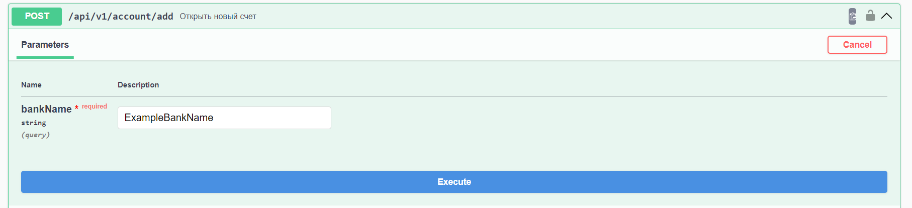
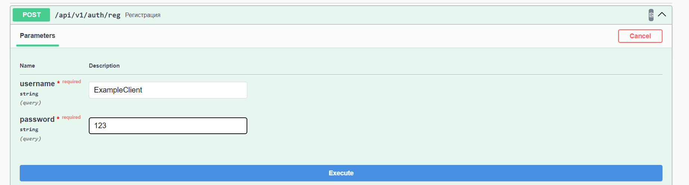
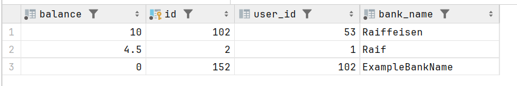

# Java-Raiffeisen

## Тестовое задание на стажировку в Райффайзен Банк. Лето 2024

1. Реализован базовый функционал требуемый в задании.

2. Реализована аутенфикация с помощью JWT-токена.

3. Реализован доступ к эндпоинтам по ролям, в частности по permisson-ам:

   1. Регистрация\аутенфикация\swagger-ui доступны без ограничений по ролям.
   2. Клиент может выполнять CRUD операции только со своими счетами.

4. Реализован Swagger UI, в том числе и авторизация.

5. Используется СУБД Postgre. Поднимается в докер-контейнер.

6. Реализованы миграции БД с помощью Flyway

## Пример работы приложения

Поднимается на порте 8080. По ссылке http://localhost:8080/swagger-ui/index.htm доступен Swagger UI.

Пытаемся открыть новый счет не пройдя аутенфикацию :

Получаем 403 :

Требуется аутенфикация\регистрация. Зарегистрируем нового клиента:

В ответ получаем JWT-токен :

Проверим что новый клиент появился в БД и что его пароль был зашифрован:

Полученный токен вставляем в Authorize:

Возвращаемся обратно к созданию счета. Можно заметить, что замок закрылся.

В этот раз создание счета прошло успешно

Проверим наличие счета в БД :

Попробуем положить деньги на этот счет :

Успешно :

Проверим БД - баланс изменился :

В базе данных доступен еще один счет. Попробуем положить на него деньги.

Т.к. счет зарегестрирован за другим клиентом, запрос вернул ошибку.

